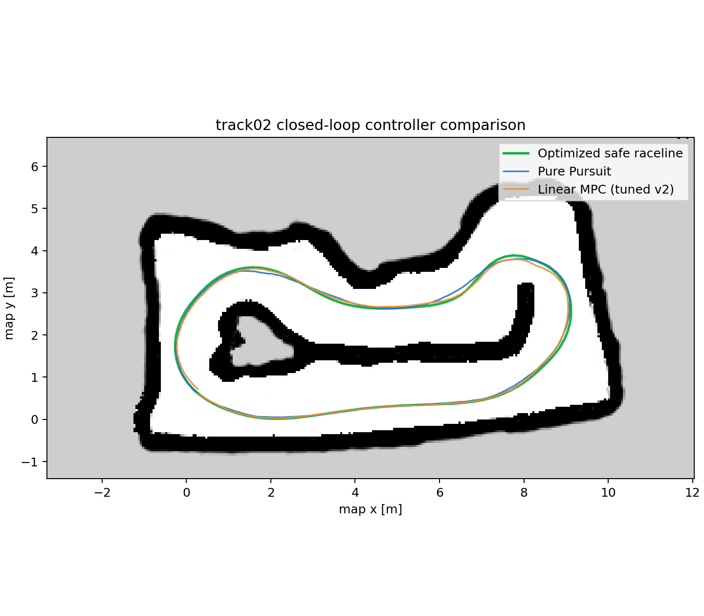

# F1TENTH ROS 2 Humble

실차 SLAM 맵을 F1TENTH Gym에서 반복 검증하기 위한 ROS 2 Humble 스택입니다.
AMCL, raceline, LaserScan 기반 정적 장애물 회피, Pure Pursuit, Linear MPC를 한
launch에서 선택해 실행합니다.

## 실행 구조

```text
map + scan -> AMCL -> map→odom→base_link
raceline  -> local obstacle planner -> /planning/path
                                      -> controller -> /drive -> Gym
```

실행 설정의 기준 파일은 세 개뿐입니다.

| 바꿀 항목 | 수정할 파일 |
|---|---|
| 맵·시작 자세·경로·기본 마찰계수 | `config/tracks.yaml` |
| MPC 공통값·튜닝 프로필 | `algorithms/control/config/mpc_params.yaml` |
| 장애물 검출·회피 파라미터 | `algorithms/planning/config/params.yaml` |

`sim.yaml`은 Gym 단독 실행의 기본값입니다. 일반 실험에서는 복사하거나 매번
수정하지 말고 아래 launch 인자로 선택합니다.

## 최초 준비와 빌드

```bash
git clone https://github.com/Kimz1xq/f1tenth.git
cd f1tenth
xhost +SI:localuser:root
docker compose up -d --build
docker compose exec sim bash
```

컨테이너 안에서:

```bash
cd /sim_ws
source /opt/ros/humble/setup.bash
colcon build --symlink-install --packages-select \
  f1tenth_gym_ros localization planning control f1tenth_bringup
source install/setup.bash
```

코드를 수정하지 않았다면 매 실행마다 빌드할 필요는 없습니다.

## 일반 실행

컨테이너에서 다음 한 줄로 Gym, RViz, AMCL, planning, controller를 모두 실행합니다.

```bash
ros2 launch f1tenth_bringup autonomy.launch.py \
  track:=track03 controller:=mpc mpc_profile:=speed_0.55 \
  friction:=auto obstacles:=false
```

주요 선택 예시:

```bash
# AMCL과 경로만 확인
ros2 launch f1tenth_bringup autonomy.launch.py track:=track03 controller:=none

# Pure Pursuit 비교
ros2 launch f1tenth_bringup autonomy.launch.py \
  track:=track03 controller:=pure_pursuit

# 다른 맵·MPC 프로필·저마찰 조건
ros2 launch f1tenth_bringup autonomy.launch.py \
  track:=track02 controller:=mpc mpc_profile:=baseline friction:=0.80

# 매번 새로운 위치에 랜덤 장애물 2개를 생성
ros2 launch f1tenth_bringup autonomy.launch.py \
  track:=track03 controller:=mpc mpc_profile:=speed_0.55 obstacles:=true
```

속도별 파일을 만들지 않고 `speed_<m/s>`의 숫자를 목표·최대속도로 사용합니다.

```bash
ros2 launch f1tenth_bringup autonomy.launch.py \
  track:=track03 controller:=mpc mpc_profile:=speed_0.85 obstacles:=true

ros2 launch f1tenth_bringup autonomy.launch.py \
  track:=track03 controller:=mpc mpc_profile:=speed_2 obstacles:=false
```

컨트롤러는 항상 정지 상태로 시작합니다. RViz 정합, TF, local path, MPC 출력을
확인한 뒤 주행을 허용합니다.

```bash
ros2 topic echo /planning/local_status
ros2 topic echo /mpc/proposed_drive --once
ros2 topic echo /mpc/solve_time_ms
ros2 service call /control/enable std_srvs/srv/SetBool "{data: true}"
```

정지:

```bash
ros2 service call /control/enable std_srvs/srv/SetBool "{data: false}"
```

## 권장 검증 순서

1. `controller:=none obstacles:=false`로 맵, scan, AMCL을 확인합니다.
2. `map → odom → ego_racecar/base_link → ego_racecar/laser` TF를 확인합니다.
3. `/planning/global_path`와 `/planning/path`가 도로 안에 있는지 확인합니다.
4. Pure Pursuit로 기준 기록을 얻습니다.
5. MPC dry-run에서 제안 조향과 solver 시간을 확인한 뒤 1랩을 주행합니다.
6. 같은 시작 자세·맵·마찰계수로 MPC 프로필을 비교합니다.
7. 마지막에 장애물을 켜고 seed별 충돌·최소 여유거리·랩타임을 비교합니다.

확인 명령:

```bash
ros2 topic hz /scan
ros2 topic hz /planning/path
ros2 run tf2_ros tf2_echo map ego_racecar/base_link
ros2 run tf2_tools view_frames
rqt_graph
```

## 장애물 실험

실행 중 장애물을 새로 배치하거나 제거할 수 있습니다.

```bash
ros2 service call /simulation/randomize_obstacles std_srvs/srv/Trigger "{}"
ros2 topic echo /planning/local_status
ros2 topic echo /safety/emergency_stop

ros2 service call /simulation/clear_obstacles std_srvs/srv/Trigger "{}"
```

`/simulation/obstacles_ground_truth`는 시각화·평가 전용입니다. 회피 경로는 이
정답 토픽이 아니라 `/scan`과 `/map`으로 계산합니다. MPC는 장애물을 직접 검출하는
모듈이 아니라 local planner가 만든 회피 경로를 차량 제약 안에서 추종합니다.
LaserScan은 0.08초 TF 대기 큐를 거쳐 측정 timestamp의 좌표로 변환하며, 같은
위치에서 3프레임 연속 검출된 클러스터만 장애물로 확정해 벽·TF 오차에 의한
단발성 노란 Marker를 억제합니다.
`obstacles:=true`에서는 시작할 때와 한 랩을 완료할 때마다 새로운 난수 seed로
장애물 2개를 자동 재배치합니다. 재현 실험이 필요하면 `sim.yaml`의
`random_obstacle_seed`를 0 이상의 고정값으로 설정하면 이후 랩에서 seed가 1씩
증가합니다. 자동 재배치를 끄려면 `randomize_obstacles_on_lap`을 `false`로
설정합니다.

## 실험 결과 관리

원시 CSV와 rosbag은 Git에 넣지 않고 `runs/` 아래에 저장합니다.

```text
runs/<track>/<controller>_<profile>_mu<friction>_seed<seed>/
```

예:

```bash
python3 /sim_ws/src/control/scripts/closed_loop_test.py \
  --duration 210 --laps 3.0 --max-error 0.30 \
  --output /sim_ws/src/f1tenth_gym_ros/runs/track03/mpc_tuned_v2_mu1.0489_seed42.csv
```

Git에는 최종 비교 그래프와 요약 표만 `results/`에 남깁니다. 기존 track02 원본
CSV·bag·중간 경로·예전 맵은 손실 없이 다음 위치에 보관했습니다.

```text
/home/kimi/f1tenth_experiment_archive/2026-08-09_track02/
```

## 새 맵 또는 튜닝 추가

새 맵은 다음 네 파일만 최종본으로 유지합니다.

```text
maps/<track>.<pgm|png>
maps/<track>.yaml
algorithms/planning/waypoints/<track>_centerline.csv
algorithms/planning/waypoints/<track>_raceline.csv
```

경로 검증 후 `config/tracks.yaml`에 항목 하나를 추가하면 됩니다. 맵마다 launch나
MPC 설정 파일을 복사하지 않습니다. 속도는 YAML 항목을 추가하지 않고
`mpc_profile:=speed_<m/s>`로 실행할 때 지정합니다.

## 현재 기준 성능

track02, 장애물 없음, 저속 1랩 기준입니다.

| Controller | Lap [s] | Mean CTE [m] | P95 CTE [m] | Collision |
|---|---:|---:|---:|---:|
| Pure Pursuit safe | 48.45 | 0.068 | 0.116 | 0 |
| MPC baseline | 44.13 | 0.117 | 0.211 | 0 |
| MPC tuned v1 | 42.78 | 0.102 | 0.240 | 0 |
| MPC tuned v2 | 56.56 | 0.070 | 0.111 | 0 |



세부 모델과 파라미터 의미는
[MPC 가이드](algorithms/control/MPC_GUIDE.md)를 참고하세요.

## 주요 폴더

```text
config/tracks.yaml             맵/경로 선택 목록
maps/                          실행 가능한 최종 맵
algorithms/planning/waypoints/ 실행 가능한 최종 경로
algorithms/planning/           전역 경로와 장애물 회피
algorithms/control/            Pure Pursuit, Linear MPC, 평가 도구
algorithms/f1tenth_bringup/    전체 스택 단일 launch
results/                       검토 완료한 비교 자료
runs/                          원시 실험 결과(Git 제외)
```

## License

[MIT License](LICENSE)
